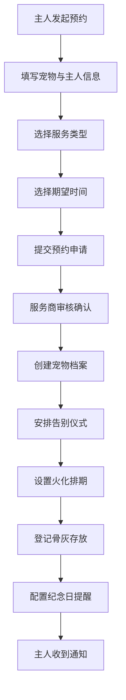

## 1. 产品概述
面向宠物殡葬服务商的专业管理平台，帮助服务商高效管理宠物档案、告别仪式、火化安排、骨灰存放等核心业务流程，并提供主人远程预约与纪念日提醒功能。
- 解决传统殡葬服务行业信息分散、管理混乱的问题，提升服务效率和客户体验
- 目标用户：宠物殡葬服务商运营人员、宠物主人

## 2. 核心功能

### 2.1 用户角色
| 角色 | 注册方式 | 核心权限 |
|------|----------|----------|
| 服务商管理员 | 账号密码登录 | 全部功能管理、数据统计 |
| 宠物主人 | 手机号/远程预约 | 查看宠物信息、预约服务、设置纪念日提醒 |

### 2.2 功能模块
1. **仪表盘主页**：数据概览、今日待办、快捷入口
2. **宠物档案管理**：宠物基本信息（品种、年龄、性别、照片）、主人信息、备注
3. **告别仪式安排**：仪式时间、地点、参与人员、仪式流程安排
4. **火化时间管理**：火化排期、火化炉分配、火化状态跟踪
5. **骨灰盒存放管理**：存放位置（区域/架位/编号）、存取记录、存放期限
6. **主人远程预约**：服务类型选择、预约时间、在线表单提交
7. **纪念日提醒**：纪念日设置、提醒方式（邮件/短信）、提醒周期配置

### 2.3 页面详情
| 页面名称 | 模块名称 | 功能描述 |
|----------|----------|----------|
| 仪表盘 | 数据概览卡片 | 显示在管宠物数、今日仪式数、待火化数、存放骨灰盒数 |
| 仪表盘 | 今日日程 | 按时间线展示当天所有安排 |
| 仪表盘 | 快捷操作 | 新增宠物、安排仪式、设置提醒等快捷入口 |
| 宠物档案列表 | 列表展示 | 分页展示所有宠物档案，支持搜索筛选 |
| 宠物档案详情 | 基本信息 | 展示宠物照片、品种、年龄、主人信息等 |
| 宠物档案详情 | 关联服务 | 关联展示该宠物的仪式、火化、骨灰存放记录 |
| 告别仪式管理 | 仪式日历 | 以日历视图展示仪式排期 |
| 告别仪式管理 | 仪式表单 | 创建/编辑仪式信息，关联宠物档案 |
| 火化管理 | 火化排期表 | 展示各火化炉的使用排期，支持拖拽调整 |
| 火化管理 | 状态流转 | 标记火化状态（待开始/进行中/已完成） |
| 骨灰存放管理 | 位置地图 | 可视化展示存放区域、架位、骨灰盒位置 |
| 骨灰存放管理 | 存取记录 | 记录骨灰盒的存入、取出历史 |
| 主人预约中心 | 预约表单 | 主人填写宠物信息、选择服务类型和时间 |
| 纪念日管理 | 提醒列表 | 展示所有即将到来的纪念日，支持配置提醒 |

## 3. 核心流程

### 服务商核心工作流
服务商登录系统 → 创建宠物档案 → 安排告别仪式 → 设置火化时间 → 登记骨灰存放位置 → 关联主人信息 → 设置纪念日提醒

### 主人远程预约流程
主人进入预约页面 → 填写宠物和主人信息 → 选择服务类型（告别仪式/火化/全套服务）→ 选择期望时间 → 提交预约 → 服务商确认 → 主人收到通知 → 设置纪念日提醒

## 4. 用户界面设计

### 4.1 设计风格
- **主色调**：深棕色 #5D4E37（庄重、温暖），搭配米白色 #FAF6F0 背景
- **辅助色**：柔和金色 #C9A962（点缀、高亮），深灰色 #3D3D3D（文字）
- **按钮风格**：圆角 8px，带有轻微阴影，悬停时有颜色加深效果
- **字体**：标题使用 "Noto Serif SC" 衬线字体，正文使用 "Noto Sans SC" 无衬线字体
- **布局风格**：侧边栏导航 + 主内容区，卡片式布局，充足留白
- **图标风格**：使用线性风格图标，配合柔和色调

### 4.2 页面设计概览
| 页面名称 | 模块名称 | UI 元素 |
|----------|----------|----------|
| 仪表盘 | 数据概览 | 渐变卡片背景、大数字展示、图标动画 |
| 仪表盘 | 时间线 | 垂直时间线，带有状态颜色标记 |
| 宠物档案 | 列表卡片 | 宠物照片圆形裁切、信息网格布局、悬停阴影 |
| 宠物档案 | 详情页 | 大图头部、分栏布局、标签页切换 |
| 告别仪式 | 日历视图 | 月历视图，事件色块标记，拖拽交互 |
| 骨灰存放 | 位置图 | 网格化架位展示，颜色区分空闲/占用状态 |
| 主人预约 | 表单页 | 分步表单引导，柔和的渐变分隔线 |

### 4.3 响应式
- 桌面端优先设计（1280px 以上）
- 平板端（768px-1280px）：侧边栏折叠为图标导航
- 移动端（768px 以下）：底部 Tab 导航，列表单列展示，日历改为周视图
