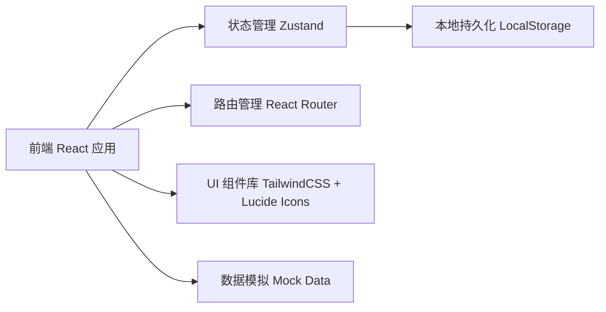
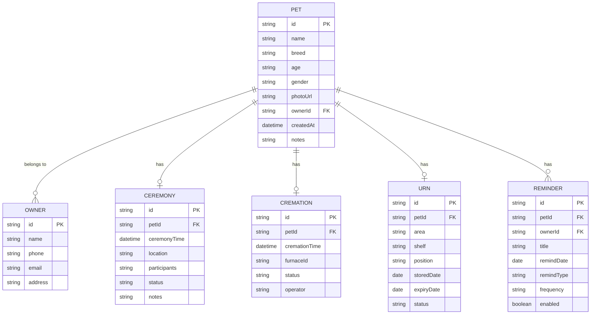

## 1. 架构设计



## 2. 技术说明
- **前端框架**：React@18 + TypeScript
- **构建工具**：Vite
- **路由方案**：react-router-dom@6
- **状态管理**：zustand
- **样式方案**：tailwindcss@3
- **图标库**：lucide-react
- **数据存储**：LocalStorage（本地持久化）+ Mock 数据
- **后端**：无（纯前端实现，数据本地存储）

## 3. 路由定义
| 路由 | 页面 | 用途 |
|------|------|------|
| / | Dashboard | 仪表盘主页，数据概览和快捷操作 |
| /pets | PetList | 宠物档案列表页 |
| /pets/:id | PetDetail | 宠物档案详情页 |
| /pets/new | PetForm | 新增宠物档案 |
| /ceremonies | CeremonyList | 告别仪式管理列表 |
| /ceremonies/new | CeremonyForm | 新增告别仪式安排 |
| /cremations | CremationList | 火化时间管理 |
| /urns | UrnStorage | 骨灰盒存放管理 |
| /booking | OwnerBooking | 主人远程预约页面 |
| /reminders | ReminderList | 纪念日提醒管理 |

## 4. 数据模型

### 4.1 实体关系图



### 4.2 数据类型定义（TypeScript）

```typescript
interface Owner {
  id: string;
  name: string;
  phone: string;
  email: string;
  address?: string;
}

interface Pet {
  id: string;
  name: string;
  breed: string;
  age: string;
  gender: 'male' | 'female';
  photoUrl: string;
  ownerId: string;
  createdAt: string;
  notes?: string;
}

interface Ceremony {
  id: string;
  petId: string;
  ceremonyTime: string;
  location: string;
  participants: string;
  status: 'pending' | 'in-progress' | 'completed' | 'cancelled';
  notes?: string;
}

interface Cremation {
  id: string;
  petId: string;
  cremationTime: string;
  furnaceId: string;
  status: 'pending' | 'in-progress' | 'completed';
  operator?: string;
}

interface Urn {
  id: string;
  petId: string;
  area: string;
  shelf: string;
  position: string;
  storedDate: string;
  expiryDate?: string;
  status: 'stored' | 'retrieved';
}

interface Reminder {
  id: string;
  petId: string;
  ownerId: string;
  title: string;
  remindDate: string;
  remindType: 'email' | 'sms' | 'both';
  frequency: 'once' | 'yearly';
  enabled: boolean;
}
```
